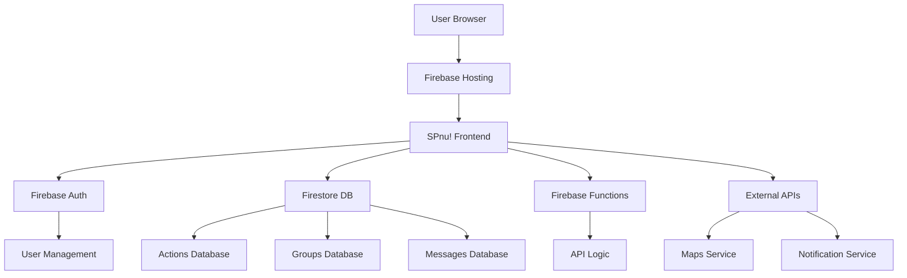

# 📚 SPnu! Platform Documentatie

Welkom bij de officiële documentatie van SPnu! - het digitale actieplatform van de Socialistische Partij Nederland.

## 🎯 Voor Wie Is Deze Documentatie?

### 👥 Gebruikers
Nieuwe en bestaande gebruikers die het platform willen leren gebruiken
→ **Start hier**: [Gebruikershandleiding](user-guide.md)

### 💻 Developers  
Ontwikkelaars die willen bijdragen aan het platform
→ **Start hier**: [Contributing Guidelines](../CONTRIBUTING.md)

### 🏗️ DevOps & Administrators
System administrators en deployment managers
→ **Start hier**: [Deployment Guide](deployment.md)

### 🔌 API Integrators
Developers die integreren met SPnu! APIs
→ **Start hier**: [API Documentation](api.md)

## 📖 Documentatie Overzicht

### Getting Started

| Document | Beschrijving | Voor Wie | Tijd |
|----------|-------------|----------|------|
| [Installation Guide](installation.md) | Complete installatie instructies | Alle developers | 15 min |
| [Quick Start](../README.md#snelstart) | Snel aan de slag | Nieuwe gebruikers | 5 min |
| [User Guide](user-guide.md) | Volledige gebruikershandleiding | Eindgebruikers | 30 min |

### Development

| Document | Beschrijving | Voor Wie | Tijd |
|----------|-------------|----------|------|
| [Contributing Guidelines](../CONTRIBUTING.md) | Hoe bij te dragen aan SPnu! | Contributors | 20 min |
| [API Documentation](api.md) | Technische API referentie | Developers | 45 min |
| [Code Standards](../CONTRIBUTING.md#code-standards) | Coding guidelines | Developers | 15 min |

### Operations

| Document | Beschrijving | Voor Wie | Tijd |
|----------|-------------|----------|------|
| [Deployment Guide](deployment.md) | Production deployment | DevOps | 30 min |
| [Security Guidelines](../CONTRIBUTING.md#security-guidelines) | Beveiligingsrichtlijnen | All developers | 20 min |
| [Troubleshooting](troubleshooting.md) | Oplossingen voor veelvoorkomende problemen | Support teams | 15 min |

## 🚀 Quick Navigation

### Ik wil...

#### Als Gebruiker:
- **Een account aanmaken** → [User Guide: Aan de Slag](user-guide.md#aan-de-slag)
- **Een actie organiseren** → [User Guide: Acties Organiseren](user-guide.md#acties-organiseren)  
- **Lokale groepen vinden** → [User Guide: Lokale Groepen](user-guide.md#lokale-groepen)
- **De kaart gebruiken** → [User Guide: Kaart Functionaliteit](user-guide.md#kaart-functionaliteit)
- **Hulp krijgen** → [User Guide: Veelgestelde Vragen](user-guide.md#veelgestelde-vragen)

#### Als Developer:
- **Het project lokaal draaien** → [Installation Guide](installation.md#development-setup)
- **Een bug fixen** → [Contributing: Bug Reports](../CONTRIBUTING.md#bug-reports)
- **Een nieuwe feature toevoegen** → [Contributing: Development](../CONTRIBUTING.md#development-setup)
- **Code reviewen** → [Contributing: Code Review](../CONTRIBUTING.md#code-review-process)
- **Tests schrijven** → [Contributing: Testing](../CONTRIBUTING.md#testing)

#### Als Administrator:
- **Het platform deployen** → [Deployment Guide](deployment.md#deployment-environments)
- **Monitoring opzetten** → [Deployment: Monitoring](deployment.md#monitoring--analytics)
- **Veiligheid configureren** → [Deployment: Security](deployment.md#security--performance)
- **Performance optimaliseren** → [Deployment: Performance](deployment.md#performance-optimization)

## 🛠️ Technische Architectuur

### System Overview



### Technology Stack

| Layer | Technology | Purpose |
|-------|------------|---------|
| **Frontend** | Vanilla JS, HTML5, CSS3 | User interface |
| **Build** | Webpack, Babel | Asset bundling |
| **Backend** | Firebase Functions | API logic |
| **Database** | Firestore | Document storage |
| **Auth** | Firebase Auth | User management |
| **Hosting** | Firebase Hosting | Static hosting |
| **Maps** | Leaflet.js | Interactive maps |
| **Analytics** | Firebase Analytics | Usage tracking |
| **Monitoring** | Firebase Performance | Error tracking |

## 📱 Platform Features

### Core Functionality

- **🎯 Action Organization**: Create and manage political actions
- **📍 Location-based Discovery**: Find local groups and events  
- **💬 Real-time Communication**: Chat and messaging system
- **🗺️ Interactive Maps**: Visualize actions geographically
- **👥 Group Management**: Join and create local SP chapters
- **📊 Impact Tracking**: Measure action effectiveness
- **🔐 Secure Platform**: Privacy-first architecture
- **📱 Progressive Web App**: Mobile-optimized experience

### Target Audience

- **SP Members**: Existing Socialistische Partij members
- **Political Activists**: People interested in social justice
- **Local Organizers**: Community action coordinators  
- **Young Socialists**: Students and young professionals
- **Union Members**: Labor organization participants

## 🔧 Development Resources

### Essential Links

| Resource | URL | Description |
|----------|-----|-------------|
| **Production Site** | [spnu.nl](https://spnu.nl) | Live platform |
| **GitHub Repository** | [github.com/jedixcom/SPnu](https://github.com/jedixcom/SPnu) | Source code |
| **Firebase Console** | [console.firebase.google.com](https://console.firebase.google.com/project/spnu-nl) | Backend management |
| **Issue Tracker** | [GitHub Issues](https://github.com/jedixcom/SPnu/issues) | Bug reports & features |
| **Discussions** | [GitHub Discussions](https://github.com/jedixcom/SPnu/discussions) | Community chat |

### Development Tools

```bash
# Essential development stack
npm install -g firebase-tools    # Firebase CLI
npm install -g @babel/core       # JavaScript transpiler  
npm install -g webpack-cli       # Build tool
npm install -g eslint           # Code linting
npm install -g prettier         # Code formatting
```

### Browser Extensions

- **Vue.js devtools**: Voor component debugging
- **Firebase DevTools**: Backend inspection  
- **Lighthouse**: Performance auditing
- **axe DevTools**: Accessibility testing
- **React Developer Tools**: Component tree inspection

## 📋 Documentation Standards

### Writing Guidelines

- **Language**: Primair Nederlands, Engels voor technische termen
- **Tone**: Vriendelijk maar professioneel
- **Structure**: Gebruik headers, lijsten en code blocks
- **Examples**: Altijd praktische voorbeelden geven
- **Links**: Relatieve links naar andere docs
- **Images**: Alt-text voor accessibility

### Markdown Conventions

```markdown
# H1: Document titel
## H2: Hoofdsecties  
### H3: Subsecties
#### H4: Details

- Lijsten voor stappen
1. Genummerde lijsten voor procedures

**Bold**: Belangrijke punten
*Italic*: Benadrukte termen
`code`: Inline code
```code blocks```: Code voorbeelden

> Quotes voor belangrijke notities

[Links](url): Altijd beschrijvende linktekst
```

### Code Examples

Alle code voorbeelden moeten:
- Werkende syntax hebben
- Commentaar bevatten waar nodig
- Error handling tonen
- Realistische data gebruiken
- Up-to-date libraries gebruiken

## 🆘 Hulp & Support

### Voor Gebruikers

- **📧 Email**: support@spnu.nl
- **💬 Live Chat**: Via spnu.nl website
- **📱 WhatsApp**: Vraag link bij lokale SP afdeling
- **🏛️ SP Nederland**: [sp.nl/contact](https://sp.nl/contact)

### Voor Developers

- **🐛 Bug Reports**: [GitHub Issues](https://github.com/jedixcom/SPnu/issues/new?template=bug_report.md)
- **💡 Feature Requests**: [GitHub Issues](https://github.com/jedixcom/SPnu/issues/new?template=feature_request.md)  
- **💬 Questions**: [GitHub Discussions](https://github.com/jedixcom/SPnu/discussions)
- **📧 Technical**: tech@spnu.nl

### Voor Administrators

- **🚨 Emergency**: emergency@spnu.nl
- **🔒 Security**: security@spnu.nl
- **⚙️ Operations**: ops@spnu.nl
- **📊 Analytics**: analytics@spnu.nl

## 🔄 Documentation Updates

### Contributing to Docs

1. **Fork** het repository
2. **Branch** maken: `docs/update-user-guide`
3. **Edit** relevante markdown bestanden
4. **Test** links en formatting
5. **Submit** pull request

### Review Process

- **Technical accuracy**: Door subject matter experts
- **Language**: Door Nederlandse native speakers  
- **Accessibility**: Screenshots met alt-text
- **Links**: Alle interne en externe links testen
- **Examples**: Code voorbeelden uitproberen

### Version Control

- **Major updates**: Bij nieuwe platform features
- **Minor updates**: Bij bug fixes of verbeteringen
- **Patches**: Bij typos of kleine correcties
- **Archive**: Oude versies bewaren voor referentie

---

## 🌟 Bijdragen aan SPnu!

SPnu! is open source en wordt gebouwd door de gemeenschap, voor de gemeenschap. Of je nu een:

- **🔧 Developer** bent die code wil bijdragen
- **📝 Writer** bent die documentatie wil verbeteren  
- **🎨 Designer** bent die UX/UI wil optimaliseren
- **🧪 Tester** bent die bugs wil vinden
- **🌍 Translator** bent die wil helpen met internationalisatie
- **📢 Activist** bent die feedback heeft vanuit gebruikersperspectief

**Jouw bijdrage is welkom!**

### Volgende Stappen

1. 📖 **Lees** de [Contributing Guidelines](../CONTRIBUTING.md)
2. 🍴 **Fork** het [GitHub repository](https://github.com/jedixcom/SPnu)  
3. 🛠️ **Setup** je [development environment](installation.md)
4. 🎯 **Kies** een [issue om op te pakken](https://github.com/jedixcom/SPnu/issues)
5. 💪 **Maak** je eerste contribution!

---

*"Niet rijk, niet arm, maar samen!"* - SPnu! Platform wordt gebouwd met solidariteit en open source principes. 🌹